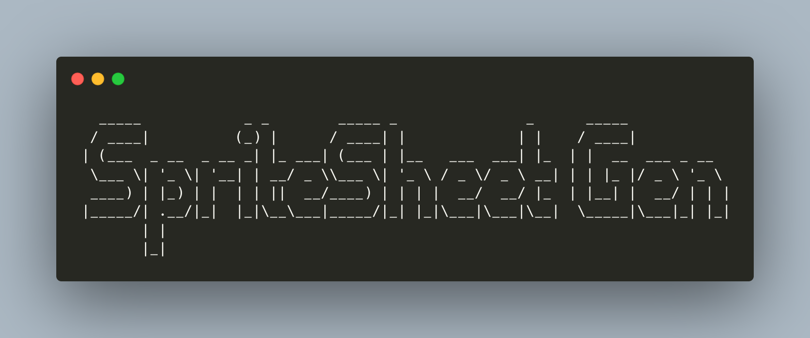

[![LinkedIn][linkedin-shield]][linkedin-url]


<!-- PROJECT LOGO -->
<br />
<p align="center">
  <a href="https://github.com/Heifarabuval/Css-Generator/tree/master/MergeImgCssGeneratorDelete">
    
  </a>
 
  <h3 align="center">Sprite Sheet Generator</h3>

  <p align="center">
    Improve performances by using sprites sheets: reduces the memory usage and speeds up the startup!
    <br />
    <br />
  </p>


<!-- TABLE OF CONTENTS -->
<details open="open">
  <summary>Table of Contents</summary>
  <ol>
    <li>
      <a href="#about-the-project">About The Project</a>
    </li>
    <li>
      <a href="#getting-started">Getting Started</a>
      <ul>
        <li><a href="#prerequisites">Prerequisites</a></li>
        <li><a href="#installation">Installation</a></li>
      </ul>
    </li>
    <li><a href="#usage">Usage</a></li>
  </ol>
</details>


<!-- ABOUT THE PROJECT -->
## About The Project

[![Product Name Screen Shot][product-screenshot]](readMeImg/sprite.png)

At the beginning we have a directory with .png images in. The main idea is concatenated all images in one.
Then, the program generate a Css file witch represent this concatenation.
In addition, it'll generate an HTML file linked to the Css file and delete all the given images.

Restrictions:
* Do not use ````scandir```` PHP function
* Do not use PHP iterative class ````RecursiveDirectoryIterator````


<!-- GETTING STARTED -->
## Getting Started

### Prerequisites

What you need to use the software and how to install it:
* First you need at least PHP 5.6 so check your version with:
  ```sh
  php -v
  ```
  
* Use the following command to know if gd.so is enabled: 
  ```sh
  grep -r extension=gd.so /etc/php*
  ```
  * Should give you: `extension=gd.so`
  * In the other case: `;extension=gd.so` go to php.ini and uncomment this line by removing the semicolon before `extension=gd.so`
    

### Installation

1. Clone the repo
   ```sh
   git clone https://github.com/Heifarabuval/Css-Generator.git
   ```
   
2. Make sure gd library is enabled.


<!-- USAGE EXAMPLES -->
## Usage
I want to concatenate images contains by my directory **Images**:
```sh
php ImageMerge.php /home/laptop/Images/images
```

I want to concatenate images contains by my directory **Images** and is subdirectories:
```sh
php ImageMerge.php /home/laptop/Images/images -r
```
I want to concatenate images contains by my directory **Images**, change the output Css and image name using short options:
```sh
php ImageMerge.php /home/laptop/Images/images -s cssName.css -i imageName.css
```
You can use the long version also:
```sh
php ImageMerge.php /home/laptop/Images/images --output-style=cssName.css --output-image= imageName.css
```
I want to concatenate images contains by my directory **Images** and change output images size to 200px*200px and increase padding to 20px using short options:
```sh
php ImageMerge.php /home/laptop/Images/images -o 200 -p 20
```
You can use the long version also:
```sh
php ImageMerge.php /home/laptop/Images/images --override-size=200 --padding=20
```


<!-- CONTRIBUTING -->
## Contributing

Contributions are what make the open source community such an amazing place to be learn, inspire, and create. Any contributions are **greatly appreciated**.

1. Fork the Project
2. Create your Feature Branch (`git checkout -b feature/AmazingFeature`)
3. Commit your Changes (`git commit -m 'Add some AmazingFeature'`)
4. Push to the Branch (`git push origin feature/AmazingFeature`)
5. Open a Pull Request


<!-- LICENSE -->
## License

Free license

<!-- CONTACT -->
## Contact

Heifara BUVAL - [linkedIn](https://www.linkedin.com/in/heifara-buval-b1662914a/) - heifara.buval@epitech.eu

Project Link: [https://github.com/Heifarabuval/Css-Generator/tree/master/MergeImgCssGeneratorDelete](https://github.com/Heifarabuval/Css-Generator)


<!-- MARKDOWN LINKS & IMAGES -->
[linkedin-shield]: https://img.shields.io/badge/-LinkedIn-black.svg?style=for-the-badge&logo=linkedin&colorB=555
[linkedin-url]: https://www.linkedin.com/in/heifara-buval-b1662914a/
[product-screenshot]: readMeImg/sprite.png
